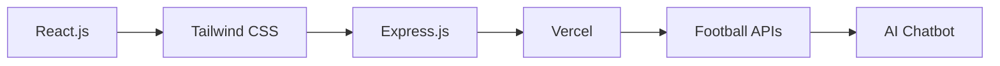

# ⚽ ScoreSpare

<div align="center">


**🔥 The most comprehensive football live score app with AI-powered insights**

[](https://score-spare.vercel.app/)
[](https://github.com/JSXRakibulhasan10/ScoreSpare)
[](https://reactjs.org/)

</div>

## 🌟 Features That Matter

<table>
<tr>
<td>

### 🔴 **Live Scores**
Real-time match updates and scores with minute-by-minute action tracking

</td>
<td>

### 📊 **League Standings** 
Complete league tables with team statistics, points, and performance metrics

</td>
</tr>
<tr>
<td>

### 📅 **Fixtures & Results**
Comprehensive match schedules and detailed historical results

</td>
<td>

### 🤖 **AI Football Chatbot**
Intelligent assistant that answers any football-related question instantly

</td>
</tr>
</table>

## 🏆 Supported Leagues

<div align="center">

| 🇬🇧 **Premier League** | 🇪🇸 **La Liga** | 🇮🇹 **Serie A** |
|:---:|:---:|:---:|
| 🇩🇪 **Bundesliga** | 🇫🇷 **Ligue 1** | 🏆 **Champions League** |

*Plus additional BPL coverage*

</div>

## 🛠️ Tech Stack

<div align="center">



</div>

### Frontend Arsenal
- ⚛️ **React.js** - Component-based UI magic
- 🎨 **Tailwind CSS** - Beautiful, responsive design
- 📱 **Mobile-First** - Perfect on any device

### Backend Power
- ⚡ **Express.js** - Lightning-fast server
- 🔄 **RESTful APIs** - Seamless data flow
- ☁️ **Vercel Deployment** - Global edge network

## 🚀 Quick Start

```bash
# Clone the magic ✨
git clone https://github.com/JSXRakibulhasan10/ScoreSpare.git

# Enter the arena ⚽
cd ScoreSpare

# Install dependencies 📦
npm install

# Launch the app 🚀
npm start
```

### Environment Setup
```env
# Backend Configuration
PORT=5000
FOOTBALL_API_KEY=your_api_key_here
CHATBOT_API_KEY=your_chatbot_api_key
```

## 🎯 How It Works

1. **🔍 Browse** - Explore live matches and real-time scores
2. **📈 Analyze** - Deep dive into league standings and team stats  
3. **📋 Plan** - Check upcoming fixtures and match schedules
4. **💬 Ask** - Chat with our AI for instant football insights
5. **📱 Enjoy** - Seamless experience across all devices

## 🤖 Chatbot Superpowers

Our AI assistant can handle:
- 📊 Team statistics and performance analysis
- 👨‍💼 Player information and transfer news
- 🔮 Match predictions and expert insights
- 🏆 League comparisons and historical data
- ⚡ Real-time match commentary

## 🌟 What Makes It Special

<details>
<summary><b>🎨 Beautiful Design</b></summary>
<br>
Modern, clean interface with smooth animations and intuitive navigation that feels native on every platform.
</details>

<details>
<summary><b>⚡ Lightning Fast</b></summary>
<br>
Optimized performance with real-time updates and minimal loading times for the best user experience.
</details>

<details>
<summary><b>🧠 Smart AI Integration</b></summary>
<br>
Advanced chatbot that understands context and provides accurate, helpful football insights instantly.
</details>

<details>
<summary><b>📱 Mobile Excellence</b></summary>
<br>
Responsive design that works flawlessly on phones, tablets, and desktop - football on the go!
</details>

## 🤝 Contributing

Love football and coding? Join the team! 

1. 🍴 Fork the project
2. 🌟 Create your feature branch (`git checkout -b feature/amazing-feature`)
3. 💫 Commit your changes (`git commit -m 'Add amazing feature'`)
4. 🚀 Push to the branch (`git push origin feature/amazing-feature`)
5. ✨ Open a Pull Request

## 🗺️ Roadmap

- [ ] 🌍 More leagues (Championship, Serie B, MLS)
- [ ] 👤 Player profiles and detailed stats
- [ ] 🎮 Fantasy football integration
- [ ] 🔔 Push notifications for favorite teams
- [ ] 📺 Video highlights integration
- [ ] 📈 Advanced analytics dashboard

## 📸 Screenshots

<div align="center">

| Live Scores | League Tables | AI Chatbot |
|:---:|:---:|:---:|
|  |  |  |

</div>

## 🙏 Acknowledgments

- ⚽ Football data providers for reliable APIs
- ⚛️ React community for amazing tools
- 🎨 Tailwind team for beautiful styling
- ☁️ Vercel for seamless deployment

## 📄 License

This project is licensed under the MIT License - see the [LICENSE](LICENSE) file for details.

---

<div align="center">

### 👨‍💻 Created with ⚽ and ❤️ by **[Rakibul Hasan](https://github.com/JSXRakibulhasan10)**

[](https://github.com/JSXRakibulhasan10)
[](https://linkedin.com/in/your-profile)

**⭐ Star this repo if you found it helpful!**

*Never miss a goal, never miss the action!* MESSI is the GOAT

</div>
